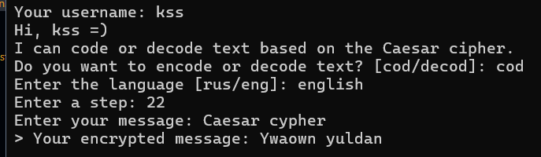

# Caesar cypher

## Description

A program for encrypting and decrypting text using the Caesar cipher algorithm. Supports English and Russian alphabets with a customizacle shift.

---

## Demo



## Features

- Encrypts and decrypts text using the Caesar cipher algorithm
- Supports English and Russian alphabets
- Allows users to choose the shift value
- Preserves the original case of letters
- Handles spaces and special characters

---

## Technologies

- Python 3
- Standard Python features (functions, loops, string manipulation)

---

## Project Structure
``` text
Caesar-cypher/
│
├── README.md
├── main.py
├── LICENSE
├── text_encryption.py
├── utils.py
├── images/
│   └── image.png
└── .gitignore
```
---

## Installation

1. Clone the repository:

``` bash
git clone git@github.com:ss29enter/Caesar-cypher.git
```

2. Navigate to the project folder:

``` bash
cd Caesar-cypher
```

3. Run the program:

``` bash
python main.py
```
---

## Usage
``` text
Enter the language [rus/eng]: eng
Enter a step: 12
Enter your message: Hello, World!

> Your encrypted message: Tqxx, Idxp!
```
---

## Algorithm

The Caesar cipher replaces each letter with another letter shifted by a fixed number of positions in the alphabet.

For example, with a shift of 3:

A → D  
B → E  
C → F

---

## What I Learned

- Working with strings and character manipulation
- Implementing encryption and decryption algorithms
- Creating a custom alphabet system for different languages
- Preserving letter case and handling special characters
- Handling user input and edge cases
- Structuring code using functions

---

## License

This project is licensed under the MIT License. See the [LICENSE](LICENSE) file for details.